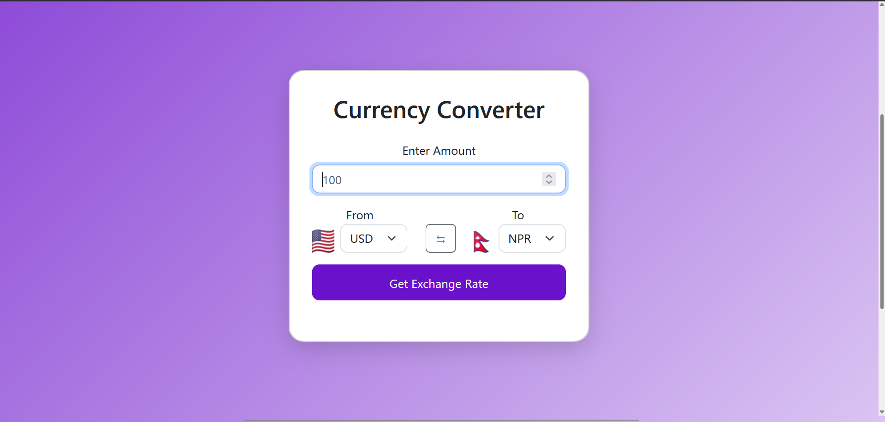
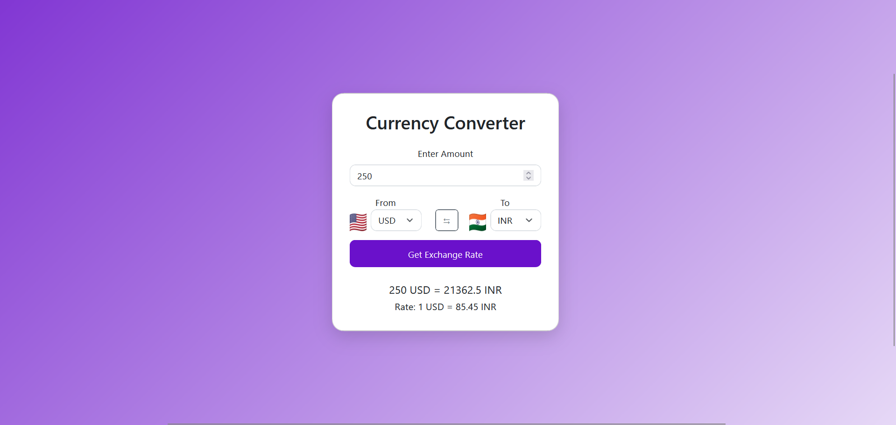
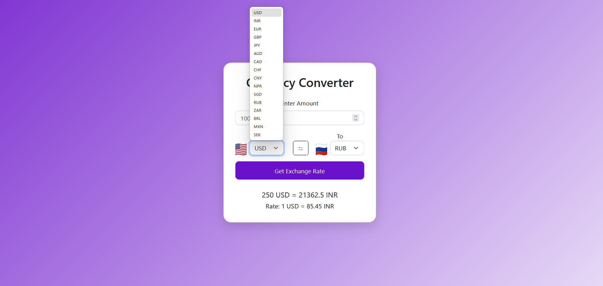
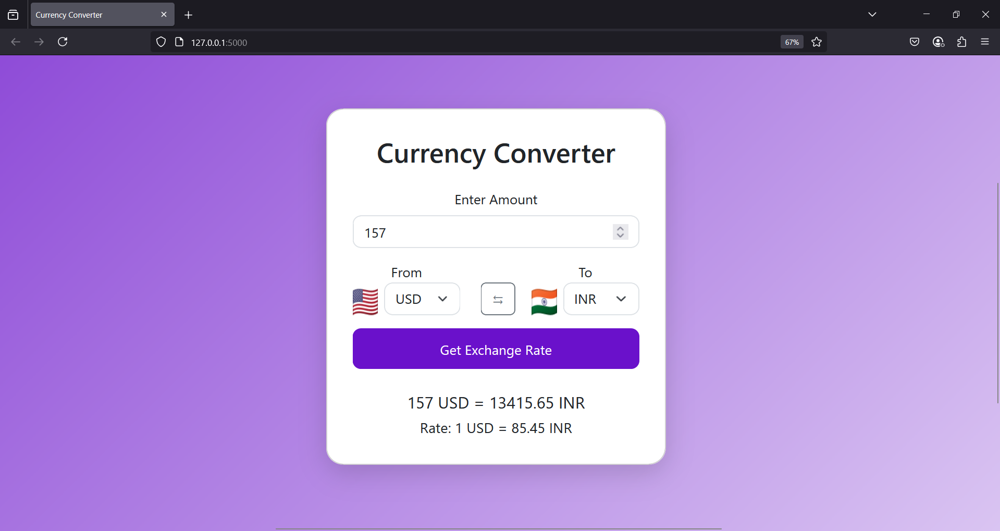

🌍 **💵Currency Converter💵**

A currency converter is an application that allows users to convert amounts between different currencies using real-time exchange rates. It typically features a user-friendly interface where users can select currencies and input amounts for conversion.

 🖼️ **Features**
- 💱 Convert between multiple world currencies (USD, INR, EUR, etc.)
- 🏳️ Country flags displayed next to each currency
- 🔃 Swap currencies instantly
- 🌐 Real-time exchange rate fetching
- 💻 Responsive and mobile-friendly design
- ⚡ Built with HTML, CSS (Bootstrap + custom), JavaScript, and Flask

🚀 **Getting Started**
1. Install Dependencies
Ensure Python and pip are installed. Then run:
pip install -r requirements.txt

2. **Run the Application**
python app.py

Visit `http://127.0.0.1:5000` in your browser.

🛠 **Technologies Used**:
- **Frontend**: HTML, CSS, Bootstrap 5, JavaScript
- **Backend**: Python Flask
- **API**: Exchange rate API (e.g., [exchangerate.host](https://exchangerate.host))
- **Flags**: [FlagCDN](https://flagcdn.com)

🌐 **Supported Currencies** (Examples)
- USD 🇺🇸
- EUR 🇪🇺
- INR 🇮🇳
- JPY 🇯🇵
- GBP 🇬🇧
- AUD 🇦🇺
- CAD 🇨🇦
- CNY 🇨🇳
- NPR 🇳🇵

📌 **Notes**
- Internet connection is required to fetch exchange rates and flag images.
- You can expand supported currencies in `script.js` by updating the `currencyList` object.
- Flag images are dynamically loaded using the country code via FlagCDN.

📄 **License**
 
 This project is open-source and available under the [MIT License](LICENSE).
